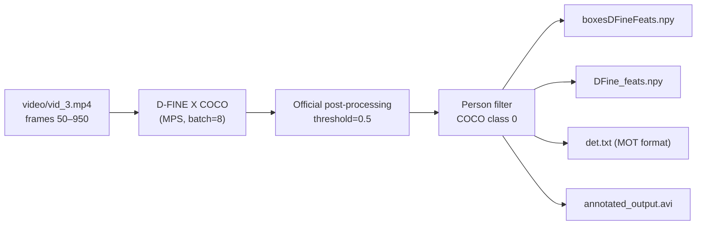
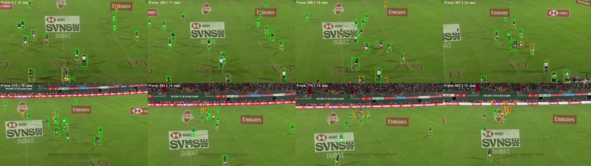

# Rugby Detection — Experiment Report

> **Date**: 2026-02-20  
> **Phase**: Detection (Object Detection)  
> **Model**: D-FINE X COCO (`ustc-community/dfine_x_coco`)  
> **Environment**: Mac MPS · PyTorch 2.10 · Transformers 4.51.x · conda env `pie`

---

## Pipeline



**Core scripts:**
- [DFinePlayer.py](DFinePlayer.py) — Main detection: video → D-FINE inference → person filtering → `.npy` output
- [evaluate_detection.py](evaluate_detection.py) — Quality analysis with statistics, temporal consistency, overlap, and visual samples
- [convert_to_mot.py](convert_to_mot.py) — Converts `.npy` to standard MOT Challenge `det.txt`

---

## Evaluation Results

| Metric | Value |
|--------|-------|
| Total detections | **13,662** |
| Frames covered | 904 (0 → 903), **0 missing** |
| Detections / frame | 15.1 ± 2.2 (min 9, max 20) |
| Confidence | mean 0.774 ± 0.107, median 0.806 |
| Confidence Q25 / Q75 | 0.708 / 0.860 |
| Box size (px) | W: 31.8 ± 11.8, H: 65.0 ± 19.7 |
| Aspect ratio (w/h) | 0.50 |
| Duplicate rate (IoU > 0.5) | 0.06% (56 / 98,569 pairs) |
| Temporal consistency CV | 0.145 |

### Assessment

- ✅ **Temporally stable** — 0 missing frames, low CV (0.145)
- ✅ **Clean detections** — only 0.06% near-duplicate rate
- ✅ **High confidence** — median 0.806, Q25 still at 0.708
- ✅ **Consistent with teammate's results** — 13,662 vs original 13,645 (0.1% difference)
- ⚠️ **~15 detections/frame** — includes players, referees, sideline staff; field-region filtering can help in tracking
- ⚠️ **No ground truth** — mAP/AP50 not computable without annotations

### Visual Sample



---

## Output Files

| File | Format | Size | Usage |
|------|--------|------|-------|
| [boxesDFineFeats.npy](boxesDFineFeats.npy) | `(13662, 6)`: `[frame, x1, y1, x2, y2, conf]` | 641 KB | Detection boxes — direct tracking input |
| [DFine_feats.npy](DFine_feats.npy) | `(13662, 256)`: D-FINE feature vectors | 13 MB | Re-ID / appearance matching |
| [det.txt](det.txt) | MOT Challenge: `frame,id,left,top,w,h,conf,-1,-1,-1` | 680 KB | Standard tracker input |
| [annotated_output.avi](annotated_output.avi) | Video with drawn bounding boxes | 131 MB | Visual verification |
| [evaluation_summary.json](evaluation_summary.json) | JSON metrics | 847 B | Machine-readable metrics |

### MOT Format (`det.txt`)

```
<frame>, <id>, <bb_left>, <bb_top>, <bb_width>, <bb_height>, <conf>, <x>, <y>, <z>
```
- `frame`: 1-indexed per MOT convention
- `id`: -1 (no tracking ID yet)
- `bb_left/top/width/height`: absolute pixel coordinates
- `x/y/z`: -1 (no 3D info)

---

## Troubleshooting Notes

> [!WARNING]
> **Transformers version matters.** D-FINE produces garbage outputs (max sigmoid score ~0.1) with Transformers 5.0.0 due to broken weight tying. Use **Transformers 4.49–4.51** for correct results.

> [!NOTE]
> The original teammate code used a custom `MyPostProcessObjectDetection.py` (fork of HuggingFace source) that returned `indexes` for feature extraction. This custom post-processing is also incompatible with newer Transformers. The current script uses the **official** `image_processor.post_process_object_detection()` with a `compute_query_indexes()` fallback for feature extraction.

---

## Environment

```bash
conda activate pie
# PyTorch 2.10.0 (MPS) · Transformers 4.51.x · OpenCV 4.13.0 · NumPy 2.4.1
```

## Folder Structure

```
Rugby_Tracking/
├── DFinePlayer.py          # Detection script (official post-processing)
├── evaluate_detection.py   # Evaluation with statistics + visual samples
├── convert_to_mot.py       # .npy → MOT det.txt converter
├── requirements.txt        # pip dependencies
├── video/                  # Input videos (symlinks)
│   ├── vid_1.mp4
│   ├── vid_2.mp4
│   └── vid_3.mp4
├── boxesDFineFeats.npy     # Detection output (N, 6)
├── DFine_feats.npy         # Feature vectors (N, 256)
├── det.txt                 # MOT format detections
├── annotated_output.avi    # Annotated video
├── evaluation_samples.png  # Visual spot-check grid
└── evaluation_summary.json # Metrics JSON
```

## Next Phase: Tracking

Detection output is ready. Reference tracking code:
- `PIE/TacTic/MakeTracks/` — Deep-EIoU tracking (basketball version)
- `PIE/Deep-EIoU/` — Deep-EIoU algorithm repository
- `PIE/boxmot/` — Multi-object tracking library
