# Rugby Tracking — Experiment Report

> **Date**: 2026-02-20  
> **Phase**: Detection + Tracking v1  
> **Environment**: Mac MPS · PyTorch 2.10 · Transformers 4.51 · conda `pie`

---

## 1. Project Overview

The goal is to detect and track rugby players across video frames using a two-stage pipeline:

1. **Detection**: Locate players in each frame (bounding boxes + features)
2. **Tracking**: Link detections across frames to form consistent trajectories

```mermaid
graph LR
    V["🎥 vid_3.mp4<br>frames 50-950"] --> D["D-FINE<br>Object Detection"]
    D --> B["boxesDFineFeats.npy<br>(N, 6)"]
    D --> F["DFine_feats.npy<br>(N, 256)"]
    B --> S["Setup Dict"]
    F --> S
    S --> T["Deep-EIoU<br>Multi-Object Tracking"]
    T --> R["tracking_dict.npy<br>track_ids"]
    R --> VZ["Visualization<br>tracked_output.avi"]
```



---

## 2. Model Architecture & Logic

### 2.1 D-FINE — Detection

**D-FINE** (Dense Fine-grained) is a DETR-variant object detector from `ustc-community/dfine_x_coco`.


**Key concepts**:
- Uses **300 object queries** (learnable embeddings) that each "ask" the image: *is there an object here?*
- Each query outputs a class logit (→ sigmoid → confidence score) and a bounding box
- Post-processing filters by confidence threshold (0.5) and keeps only `person` class (COCO ID 0)
- The `last_hidden_state` (256-dim per query) serves as an appearance feature for each detection

**Our usage** ([DFinePlayer.py](DFinePlayer.py)):
- Batch inference (8 frames at a time) on MPS
- Official `image_processor.post_process_object_detection()` for Transformers 4.51 compatibility
- `compute_query_indexes()` maps detected boxes back to query indices for feature extraction

> [!WARNING]
> Transformers 5.0 breaks D-FINE weight tying → all sigmoid scores ≈ 0.1 → zero detections. Must use Transformers 4.49–4.51.

---

### 2.2 Deep-EIoU — Tracking

**Deep-EIoU** extends the classic SORT/DeepSORT framework with **Expanded IoU** distance for more robust association in sports scenarios.


**Core components**:

| Component | Role | Code Location |
|-----------|------|---------------|
| `STrack` | Single track state: Kalman state, appearance feature, ID | `Deep_EIoU.py:11-210` |
| `KalmanFilter` | Predicts next-frame position from velocity model | `kalman_filter.py` |
| `EIoU` | Expanded IoU: enlarges boxes before computing IoU overlap — helps when Kalman prediction is off due to irregular motion | `matching.py:80-100` |
| `embedding_distance` | Cosine distance between track and detection features | `matching.py:200-215` |
| `update()` | Main per-frame logic: predict → associate → update → create/remove | `Deep_EIoU.py:236-432` |

**Association cascade** (per frame):

1. **Predict** all existing tracks to current frame using Kalman filter
2. **1st round**: Match high-confidence detections (>0.6) to tracks using combined EIoU + appearance distance
3. **2nd round**: Match remaining low-confidence detections (>0.1) to unmatched tracks using IoU only
4. **Create** new tracks from unmatched high-confidence detections (>0.7)
5. **Remove** tracks lost for more than `track_buffer` frames (default: 30)

**Key parameters for rugby tuning**:

| Parameter | Default | Effect |
|-----------|---------|--------|
| `track_buffer` | 30 | Frames to keep lost tracks (↑ for frequent occlusions) |
| `init_expand_scale` | 0.7 | Box expansion for EIoU (↑ for irregular motion) |
| `appearance_thresh` | 0.25 | Max cosine distance for Re-ID match (↑ if same-team uniforms) |
| `match_thresh` | 0.8 | IoU threshold for matching |

---

### 2.3 Feature Flow


**Current limitation**: D-FINE features encode general object semantics (what is it?) rather than appearance (what does it look like?). This means:
- ❌ Cannot distinguish teams by jersey color
- ⚠️ Re-ID matching is weaker (players look similar in feature space)
- ✅ Still usable for basic motion-based tracking

---

## 3. Experiment Pipeline

### Step 1: Detection ([DFinePlayer.py](DFinePlayer.py))

```bash
python3 -u DFinePlayer.py
```

- Input: `video/vid_3.mp4`, frames 50–950
- Output: `boxesDFineFeats.npy` (13,662 × 6), `DFine_feats.npy` (13,662 × 256)

### Step 2: Setup ([setup_tracking.py](setup_tracking.py))

```bash
python3 setup_tracking.py
```

- Creates `tracking_dict.npy` from detection output
- Marks all detections as `in_pitch=True` (no homography filtering)

### Step 3: Team Classification ([classify_teams.py](classify_teams.py))

```bash
python3 classify_teams.py
```

- HAC clustering on D-FINE features → **failed** (99.98% in one cluster)
- Reason: D-FINE features are not color/appearance-discriminative

### Step 4: Tracking ([run_tracking.py](run_tracking.py))

```bash
python3 run_tracking.py
```

- Auto-detects team availability → runs **single-tracker mode**
- Deep-EIoU with Kalman filter + EIoU + appearance matching

### Step 5: Visualization ([visualize_tracks.py](visualize_tracks.py))

```bash
python3 visualize_tracks.py
```

- Draws colored bounding boxes with track IDs on video

---

## 4. Results

### Detection

| Metric | Value |
|--------|-------|
| Total detections | **13,662** |
| Frames covered | 904 (0–903), 0 missing |
| Detections/frame | 15.1 ± 2.2 |
| Confidence | mean 0.774, median 0.806 |
| Duplicate rate | 0.06% |

### Tracking

| Metric | Value |
|--------|-------|
| Total tracks | **30** |
| Tracked detections | 12,465 / 13,662 (**91.2%**) |
| Mean track length | 416 frames |
| Max track length | 904 (full sequence) |
| Min track length | 10 frames |
| Tracking time | 0.9s |

### Analysis

- **30 tracks for ~15 players/frame**: indicates identity switches where one physical player gets multiple IDs. Expected without team separation.
- **91.2% coverage**: 8.8% untracked = short-lived fringe detections (sideline staff, partial views)
- **Max track = 904 frames**: at least one player tracked continuously through the entire sequence
- **Min track = 10 frames**: some tracks are very short fragments, candidates for post-processing merging

---

## 5. Output Files

| File | Description |
|------|-------------|
| `boxesDFineFeats.npy` | Detection boxes (N, 6): [frame, x1, y1, x2, y2, conf] |
| `DFine_feats.npy` | D-FINE features (N, 256) |
| `tracking_dict.npy` | Dict: bboxes, in_pitch, team_id, track_ids |
| `tracked_output.avi` | Annotated video with track IDs |
| `det.txt` | MOT Challenge format detections |
| `annotated_output.avi` | Detection-only annotated video |

---

## 6. Known Issues & Fixes

| Issue | Root Cause | Fix |
|-------|-----------|-----|
| D-FINE outputs 0 detections | Transformers 5.0 weight tying bug | Downgrade to 4.49–4.51 |
| `np.float` AttributeError | NumPy 2.x removed deprecated aliases | Replace with `np.float64` in `Deep_EIoU.py` and `matching.py` |
| Team classification fails | D-FINE features not appearance-discriminative | Need CLIP features |
| `boxmot` import fails | Package structure mismatch | Use standalone CLIP or fix import path |

---

## 7. Next Steps

1. **CLIP Feature Extraction** → enables team classification and better Re-ID
2. **Per-team tracking** → separate Deep-EIoU per team reduces ID switches
3. **Track post-processing** → ChainTrackFeat + GraphTrack for merging fragments
4. **Parameter tuning** → adjust `track_buffer`, `init_expand_scale` for rugby motion
5. **Homography** (optional) → pitch-plane projection for position filtering
